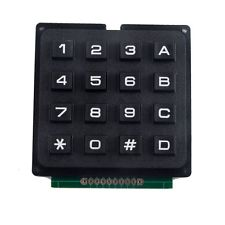
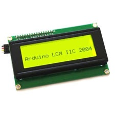
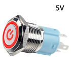
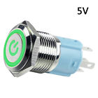

**3DFabXYZ.com**

**Arduino based Airsoft-Paintball FPS Bomb Simulator**

Basic, Professional and Modules

**OWNER’S MANUAL**

English

# Contents

[1 Introduction 1](#introduction)

[2 Package contents 1](#package-contents)

[3 Models 1](#models)

[3.1 Basic 2](#basic)

[3.2 Professional 2](#professional)

[4 Addon Modules 2](#addon-modules)

[4.1 Relay Module 2](#relay-module)

[4.2 Cutwire Module 2](#cutwire-module)

[4.3 MP3 Sound Module 2](#mp3-sound-module)

[4.4 Wireless Modules 3](#wireless-modules)

[5 Game Modes 3](#game-modes)

[5.1 Search & Destroy 3](#search-destroy)

[5.2 Sabotage 3](#sabotage)

[5.3 Domination 4](#domination)

[5.4 Armed\! 4](#armed)

[5.5 Remote Domination 4](#remote-domination)

[5.6 Capture the Flag 5](#capture-the-flag)

[6 Menu 5](#menu)

[6.1 Language Menu 5](#language-menu)

[6.2 Game Mode Selection 5](#game-mode-selection)

[6.3 Game Configuration 6](#game-configuration)

[6.3.1 Game Time HH:MM 6](#game-time-hhmm)

[6.3.2 Bomb Time HH:MM 6](#bomb-time-hhmm)

[6.3.3 Passcode 6](#passcode)

[6.3.4 Arming Time 6](#arming-time)

[6.3.5 Sound 6](#sound)

[6.3.6 Relay Enable 7](#relay-enable)

[6.3.7 Cutwire 7](#cutwire)

[6.4 Settings Menu 7](#settings-menu)

[6.4.1 I2C Device List 7](#i2c-device-list)

[6.4.2 Sound Test 7](#sound-test)

[6.4.3 Relay Test 7](#relay-test)

[6.4.4 Input Test 7](#input-test)

[6.4.5 Cutwire Test 7](#cutwire-test)

[6.4.6 LED Test 7](#led-test)

[6.4.7 Set Relay Time 7](#set-relay-time)

[6.4.8 Set Start Delay Time 7](#set-start-delay-time)

[7 User Replaceable Items 7](#user-replaceable-items)

[8 Disclaimer 8](#disclaimer)

[9 Warranty 8](#warranty)

# Introduction

The FPS Bomb Simulator is a device that is meant to bring the excitement of console games such as Battlefield ™, Call of Duty™, and CounterStrike™ to real life. The FPS Bomb Simulator can augment any Airsoft, Paintball, Milsim or Laser-tag game, especially for players who love the game type in which Terrorists and Counter-terrorists battle against each other to plant and/or defuse a bomb. The Domination game mode is perfect for those that are more into a “King of the Hill” type games. The “Armed\!” game mode with the “Passcode” enabled could also be used in an Escape Room scenario, find clues to get the passcode before it explodes\!

# Package contents

1.  FPS Bomb Simulator

2.  USB Battery Pack (Optional)

3.  Repair Kit (Optional)
    
    1.  20x4 I2C LCD
    
    2.  4x4 Keypad
    
    3.  Green Push Button
    
    4.  Red Push Button
    
    5.  RGB LED

4.  Modules (Optional)
    
    6.  Relay Module
    
    7.  Cutwire Module
    
    8.  MP3 Sound Module (Pro Only)
    
    9.  Wireless Modules (Pro Only)
        
        1.  Wireless Master Module
        
        2.  Wireless Slave Module

# Models

There are two models of the FPS Bomb Simulator.

Both models come with the following four Basic Game Modes:

1.  Search & Destroy

2.  Sabotage

3.  Domination

4.  Armed\!

Each of the games can be played in one of five languages, selectable at game start:

1.  English

2.  French\*

3.  Spanish\*

4.  Protugues\*

5.  German\*

> Note:
> 
> \*Non English accented characters are represented by closest English character.

## Basic

The “BASIC” model supports these addon modules:

1.  Relay Module

2.  Cutwire Module
    
    2.  ## Professional

The “Professional Model” supports multiple addon modules:

1.  Relay Module

2.  Cutwire Module

3.  MP3 Sound Module

4.  Wireless Master\\Slave Modules
    
    1.  Wireless Modules enable two new game modes:
        
        1.  Remote Domination
        
        2.  Capture the Flag

# Addon Modules

All game modules are “Plug and Play” and easy to install.

To install any of the modules, use the following steps:

1.  Remove the battery. (The FPS Bomb Simulator must be fully powered off.)

2.  Modules are keyed and will fit into only one slot, place the module in the corresponding “slot”.

3.  Replace the battery.

4.  Power on the device.

The modules are automatically detected upon device startup. Game configuration options for each individual module will only become available once a module has been enumerated.

## Relay Module

The “Relay Module” can be used with both Basic and Pro Editions of the FPS Bomb Simulator. It enables external lights based on the status of the RGB LED and it can be used to activate an external device when the “bomb” explodes. The “Relay Module” is available in all game modes.

## Cutwire Module

The “Cut wire Module” can be used with both Basic and Pro Editions of the FPS Bomb Simulator. This module is meant to be used as a last second option to disarm the bomb.

It is available in “Search & Destroy”, “Sabotage” and “Armed\!” game modes.

When the timer is under the required time to disarm or arm the bomb, take your chances cut a wire. Adds the adrenaline rust of suicide or success\! If any of the wires are cut before the bomb is armed the module will automatically be disabled.

## MP3 Sound Module

The “MP3 Sound Module”, enable actual voice prompts (in chosen language) at key points of the game.

With “voice in” enabled Walkie-Talkies broadcast to the entire game area\!

Requires “Pro Edition” FPS Bomb Simulator device and is available in all game modes.

## Wireless Modules

The Wireless Modules are sold as “Master” or “Slave”. They require at least two “Pro Edition” FPS Bomb Simulators in order to use these modules. Adds two new game modes: “Remote Domination” and “Capture the Flag”.

# Game Modes

There are two Models of the FPS Bomb Simulator, “BASIC” and “PRO”.

The “BASIC” Model has four game modes to choose from.

The “PRO” Model has the four “BASIC” game modes with the possibility of an additional two game modes. Additional game modes require at least two “PRO” Models with “Wireless modules” installed.

##  Search & Destroy

In this mode the device acts as a bomb.

Red button Arms bomb

Green button Disarms bomb

When "Passcode" mode is used:

1.  > Passcode entry has a programable input time limit.

2.  > "A" is used to initialize passcode entry to Arm the bomb.

3.  > "D" is used to initialize passcode entry to Disarm the bomb.

Common for both "passcode" and button modes:

1.  > The bomb can be armed and defused only once.

2.  > The bomb has to be defended by the GREEN team during Game Time.

3.  > The attacking RED team's objective is to arm the bomb and once armed must prevent the GREEN team from defusing it, until it detonates.

There are three ways to finish the game.

1.  Game time expires and RED team was unsuccessful in placing and arming the bomb, GREEN team wins.

2.  RED team is able to place and arm the bomb, but can not prevent GREEN team from disarming it. GREEN team wins.

3.  RED team is able to place and arm the bomb and GREEN team fails in disarming it, the bomb detonates. RED team wins.
    
    8.  ## Sabotage

In this mode the device acts as a bomb.

Red button Arms bomb

Green button Disarms bomb

When "Passcode" mode is used:

1.  > "A" is used to initialize passcode entry to Arm the bomb.

2.  > "D" is used to initialize passcode entry to Disarm the bomb.

Common for both "passcode" and button modes:

1.  The bomb can be armed and defused as many times as the game time allows.

2.  The bomb has to be defended by the GREEN team during Game Time.

3.  The attacking RED team's objective is to arm the bomb and once armed must prevent the GREEN team from defusing it, until it detonates.

There are two ways to finish the game.

1.  Game time expires and RED team was unsuccessful in placing and arming the bomb, GREEN team wins.

2.  RED team is able to place and arm the bomb and GREEN team fails in disarming it, the bomb detonates. RED team wins.
    
    9.  ## Domination

In this mode the device acts as a base.

Red button Captures zone for RED Team

Red button Neutralizes GREEN zone

Green button Captures zone for GREEN Team

Green button Neutralizes RED zone

1.  When game starts the base is a Neutral (BLUE) Zone.

2.  The objective for both (GREEN and RED) teams is to capture the base.

3.  Once the base is captured, it starts to count time for the controlling team.

4.  While the base is neutral no time is accumulated for either team.

The only way to win is:

1.  > The team with the highest total time in control of the base wins.
    
    10. ## Armed\!

In this mode the device acts as a bomb.

Green button Disarms bomb

When "Passcode" mode is used:

1.  > Passcode entry has a programable input time limit.

2.  > "D" is used to initialize passcode entry to Disarm the bomb.

Common for both "passcode" and button modes:

1.  > The bomb starts armed with the countdown to detonation already triggered.

There are two ways to finish the game.

1.  The bomb time expires and the GREEN team was unsuccessful in disarming the bomb, and it detonates RED team wins.

2.  The GREEN team succeeds in disarming the bomb. GREEN team wins.
    
    11. ## Remote Domination

Requires two “PRO” Model devices with wireless modules installed.

In this mode each device acts as a base.

Red button Captures zone for RED Team

Red button Neutralizes GREEN zone

Green button Captures zone for GREEN Team

Green button Neutralizes RED zone

1.  When game starts the bases are Neutral (BLUE) Zones.

2.  The objective for both (GREEN and RED) teams is to capture both bases.

3.  Once a base is captured, it starts to count time for the controlling team.

4.  While the base is neutral no time is accumulated for either team.

The only way to win is:

1.  > The team with the highest total time in control of both bases wins.
    
    12. ## Capture the Flag

Requires two “PRO” Model devices with wireless modules installed.

In this mode each device acts as a Flag for either GREEN or RED teams.

At the GREEN Flag:

Red button Captures GREEN Flag for RED Team

Green button Neutralizes Captured GREEN Flag or Plants RED Flag for GREEN team.

At the RED Flag:

Green button Captures RED Flag for GREEN Team

Red button Neutralizes Captured RED Flag or Plants GREEN Flag for RED team.

1.  When game starts both devices are Flags, one RED and the other GREEN.

2.  The objective for both (GREEN and RED) teams is to capture the remote team’s Flag and Plant it in the other device.

3.  Points are gained by successfully capturing a Flag and planting it in the other base.

The only way to win is:

1.  > The team with the highest total Flags planted wins.

# Menu

To go through the menus press “A” for up and “B” for down.

To select Menu item on screen press “D”.

## Language Menu

Set the language that will be displayed on screen.

The chosen language will become the default displayed language.

The following languages can be selected:

1.  > English

2.  > Francais (French)

3.  > Espanol (Spanish)

4.  > Portugues (Portuguese)

5.  > Deutsche (German)
    
    14. ## Game Mode Selection

Select one of the games to start the game configuration menu.

1.  > Search and Destroy

2.  > Sabotage

3.  > Domination

4.  > Armed\!
    
    15. ## Game Configuration

The game configuration menu will only display items relevant to the chosen game mode.

If any modules have been installed and the game mode supports the device, you will be able to configure it through the menu.

### Game Time HH:MM

This is to set the approximate maximum time that the game can last.

1.  The game ends sooner if the bomb detonates.

2.  If the bomb is armed with less time left than the “Bomb Time”, the game will continue until:
    
    1.  The bomb explodes.
    
    2.  The bomb is disarmed.

Time is programmable to a maximum of 99 hours and 99 minutes (100 hours and 39 minutes). Once the game is started, the remaining minutes and seconds will be displayed on the LCD. For example, with a 3 hour game, the remaining time will be 180 minutes.

To set the time use the corresponding keypad numbers. To program a 45 minute game, press 0 0 4 5 and “D” to save the time or “C” to cancel and reset the game time.

### Bomb Time HH:MM

This is the time that must elapse from the moment the bomb is armed until it detonates. It is configured the same way as the game time. For the “ARMED\!” game mode this is the game time.

### Passcode

You can select to use a passcode to arm or disarm the bomb.

#### Set passcode

Use the numeric keypad to set the passcode used to arm or disarm the bomb. Once set you will be prompted to re-enter the passcode to confirm it.

#### Passcode Hints

You will be given the option to display passcode hints. The hints will be displayed at the bottom of the screen when you are in Arming or Disarming mode.

### Arming Time

This is the required time to keep the button pressed to arm or disarm the bomb.

If the passcode option was selected it is the amount of time you have to enter the passcode.

### Sound

Enable or disable the sound in the game.

### Relay Enable

Enable or disable the relay module without having to physical remove the module.

### Cutwire

Its function is to force the bomb to be deactivated by cutting one of the 4 wires. If this function is active and one of the cables is not correctly connected before starting the game, there will be a warning to verify the connection.

Each of the 4 cables can are automaticaly set with one of the 3 available functions

The available functions are the following:

1.  "Explode" function: The bomb detonates once the cable has been cut.

2.  "Disarm" function: The bomb is deactivated once the cable has been cut.

3.  "Nothing" function: Cutting the cable has no effect on the bomb.
    
    16. ## Settings Menu

Mode to check all the systems of the simulator.

8.  ### I2C Device List

9.  ### Sound Test

10. ### Relay Test

11. ### Input Test

12. ### Cutwire Test

13. ### LED Test

14. ### Set Relay Time

15. ### Set Start Delay Time

# User Replaceable Items

The FPS Bomb Simulator has be built to easily replace parts that wear over time.

1.  USB Battery Pack

2.  Keypad

3.  LCD

4.  Push buttons

**Figure 1: 4x4 Keypad Figure 2: 20x4 I2C LCD**

 

Figure 3: Red LED PST Figure 4: Green LED SPT

Button Button

# Disclaimer

This prop module was created specifically to enhance your tactical gaming experience. 3DFabXYZ.com and any affiliates will not be held accountable for losses or consequences caused by the misuse of this product, or any of our products. Furthermore, we will not offer servicing on products that have been modified in any way. By purchasing this product, you are agreeing to the above statements. 3DFabXYZ.com and any affiliates prohibit the re-sale of this product, or any of our products. This product has been designed for the specific use of applications and may not be used for unlawful purposes, uses that are expressly prohibited under the terms, conditions and purpose of its use and diversion. No guarantees are given or implied as to the product efficiency and performance. Company, its consultants, partners, agents and employees shall not be liable for any claims, losses, expenses, injuries, or damages arising from or related to the product.

# Warranty

The term of validity of the guarantee starts from the date indicated on the purchase invoice.

Damage caused by applications not described in the instructions for use and in general for a different use for which this product has been designed, knocks, falls, external agents and interventions outside the authorized technical service will be excluded from the guarantee.

Also excluded are the aesthetic defects caused by the use, normal wear and tear and maintenance operations described in the instruction manual and which can be performed by the user.

Consumable or user replaceable items are not covered by this warranty.

